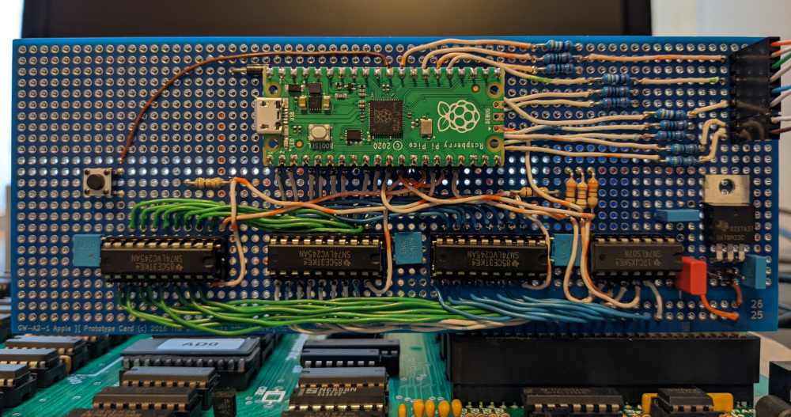
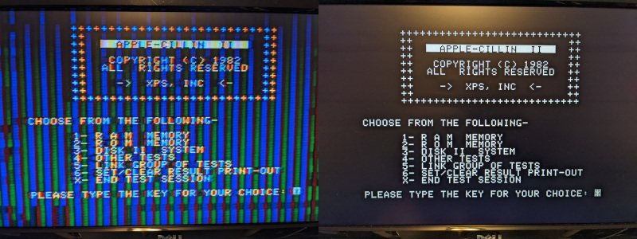
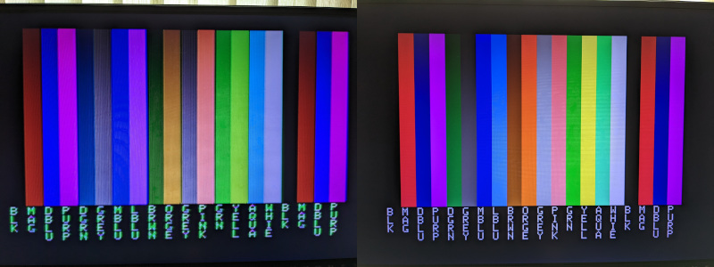
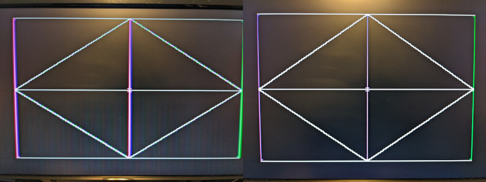

# Apple II VGA Card

This project is a VGA card for Apple II computers to ouput a crisp RGB signal to a
VGA monitor instead of having to rely on the composite output. This is accomplished
by snooping the 6502 bus and creating a shadow copy of the video memory within a
Raspberry Pi Pico, then processing the raw video memory contents to output a "perfect"
signal.

    +------+                +-----+      +-----------+
    | 6502 |________________| RAM |______| Composite | 
    | CPU  |  System   \    +-----+      | Video Gen |
    +------+   Bus     |                 +-----------+
                       |    +-----------+
                       \____| Raspberry |_________________\
                            |  Pi Pico  |   640x480 VGA   /
                            +-----------+

This project is currently in a pretty raw state so consider it useful for informational
purposes only. I've built a prototype card and it works on my Apple II+ but I only have
one Apple II+ and one VGA monitor so my testing is very limited.

These features are currently supported:
 * Generates a 640x480@60 VGA signal with 3 bits per color channel using resistor DACs
 * Text mode (monochrome)
 * Lo-res mode with no color fringing between the chunky pixels
 * Hi-res mode with simulated NTSC artifact color
 * Mixed lo-res and hi-res modes with monochrome text and no color fringing

I had these goals in mind during design:
 * Generate video out to a more modern display - I don't have any old CRTs for
   displaying composite signals any more and composite to HDMI adapters don't work well.
 * Generate crisp video - I wanted "perfect" video output, the way that it should have
   been barring technical difficulties of displays in 1980. So like, no NTSC artifact
   coloring where it's not supposed to be.
 * Non-invasive - I didn't want to have to solder or modify my logic board.
 * Common parts - The parts to build should be cheap and easy to get anywhere,
   just like the original Apple II
 * Open-source - If this helps anyone else make their Apple II better then that's
   a bonus.

I also wanted to see if a Pi Pico could actually work on an 8-bit CPU bus, since the docs
say it should work but there were no code examples.

Included in the repo here are the schematics and the source code for the Pi Pico
microcontroller. I used the unrouted PCB layout to wire up the initial prototype
board on a [Glitchworks Apple II Prototyping Board](https://www.tindie.com/products/glitchwrks/gw-a2-1-glitchworks-apple-ii-prototyping-board/).

## Comparisons

Here are a few comparisons of the VGA card output vs composite video through
a cheap composite -> HDMI adapter

**Text**

**Lores**

**Hires**

## Limitations

This VGA card design currently does have some limitations:
 * The VGA signal vsync is not synchronized with the Apple II video memory scanning so
   software that tries to detect the composite video vsync using 'vapor lock' may not
   look good.
 * All the Pi Pico GPIOs are being used so connecting to slot 7's SYNC or any other bus
   signal is a bit of a challenge without adding more chips.
