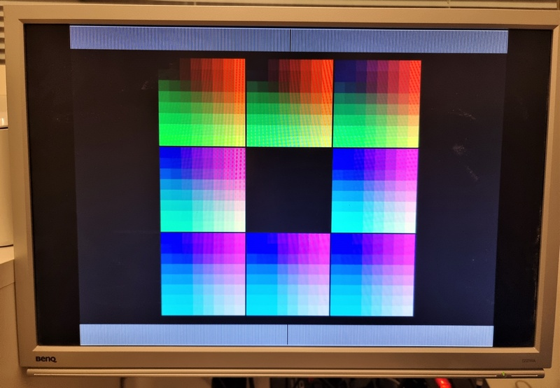

# Set Up Raspberry Pi Pico SDK and build the firmware
## Windows Subsystem for Linux (WSL)
Windows Subsystem for Linux (WSL) allows you to install a complete Ubuntu terminal environment in minutes on your Windows machine, allowing you to develop cross-platform applications without leaving Windows. [Install Ubuntu on WSL for Windows](https://ubuntu.com/tutorials/install-ubuntu-on-wsl2-on-windows-10#1-overview)

## Prepare environment
```shell
sudo apt update
sudo apt install -y build-essential
```

## Install additional tools
GIT, Cmake
```shell
sudo apt install git cmake
```
[GNU Arm Embedded Toolchain](https://lindevs.com/install-gnu-arm-embedded-toolchain-on-ubuntu)

## Install SDK
```shell
sudo git clone https://github.com/raspberrypi/pico-sdk.git /opt/pico-sdk
```

## Initialize submodules
```shell
sudo git -C /opt/pico-sdk submodule update --init
```

## Set the PICO_SDK_PATH environment variable
```shell
export PICO_SDK_PATH=/opt/pico-sdk
```

## Build the firmware for Apple IIe
```shell
cd /AppleII-VGA/pico
mkdir build
cd build
cmake -DAPPLE_MODEL=IIE -DCMAKE_BUILD_TYPE=Release ..
make
$ ls *uf2
...
applevga.uf2
```
## Build the firmware for Apple II+
```shell
cd /AppleII-VGA/pico
mkdir build
cd build
cmake -DAPPLE_MODEL=IIPLUS -DCMAKE_BUILD_TYPE=Release ..
make
$ ls *uf2
...
applevga.uf2
```
## Upload the firmware
Hold down the BOOTSEL button and connect the Raspberry Pi Pico to your PC via micro USB cable. Once Pico is connected release the BOOTSEL button. Pi Pico should be connected to PC with USB mass storage device mode.

A disk volume called RPI-RP2 will appear on your computer. Drag and drop the applevga.uf2 file to that volume. RPI-RP2 will unmount and Pico will start the program.

## Stand-alone test pattern image
There's a test pattern image in the source code that one can set to display immediately at power on, and Pico microcontroller can be powered entirely from USB. To enable test patter just uncomment `RENDER_TEST_PATTERN` flag in `render.h`:
```shell
// #define RENDER_TEST_PATTERN
```


